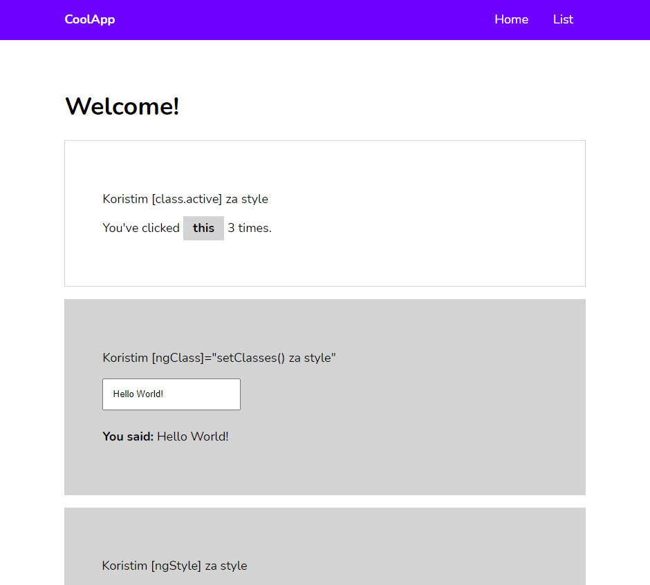
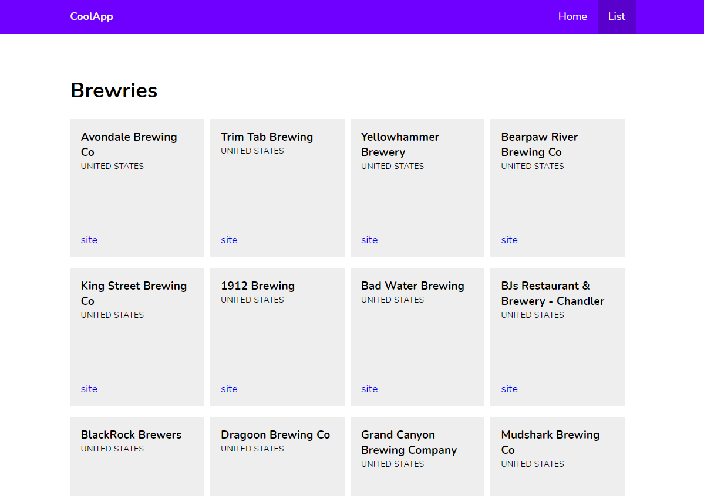

# CrashCourse

Following [Angular 8 Tutorial](https://coursetro.com/posts/code/174/Angular-8-Tutorial-&-Crash-Course)

Table of contents:

 - Angular 8 Components
 - `Navigation` & `Routing`
 - Using `One-way data binding` and `Two-way data binding`
 - `ng-template`
 - Style Binding
 - Class Binding
 - Services
 - Angular HTTP Client
 - Deployment

## Screenshots

