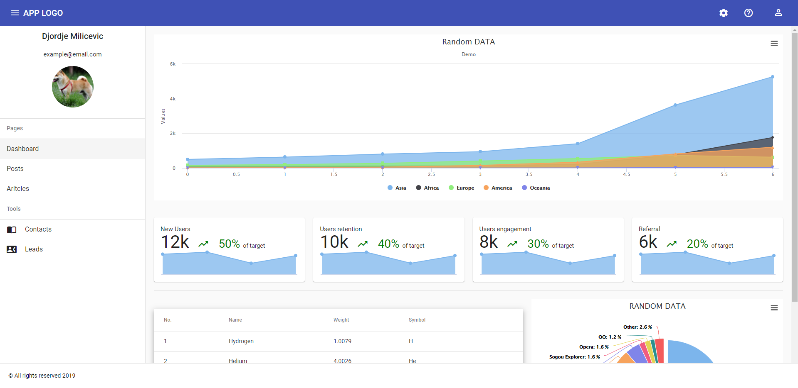
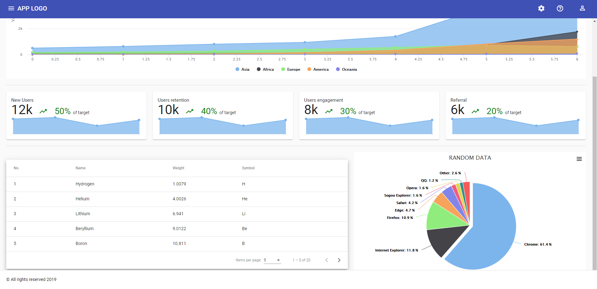

# Dashboard

Creating Dashboard looking application.

Table of contents:

 - Using `highcharts library` to build small chard widgets
 - Using multiple modules through appliaction
 - Using `angular animations` for closing and opening sidebar

## Screenshots

