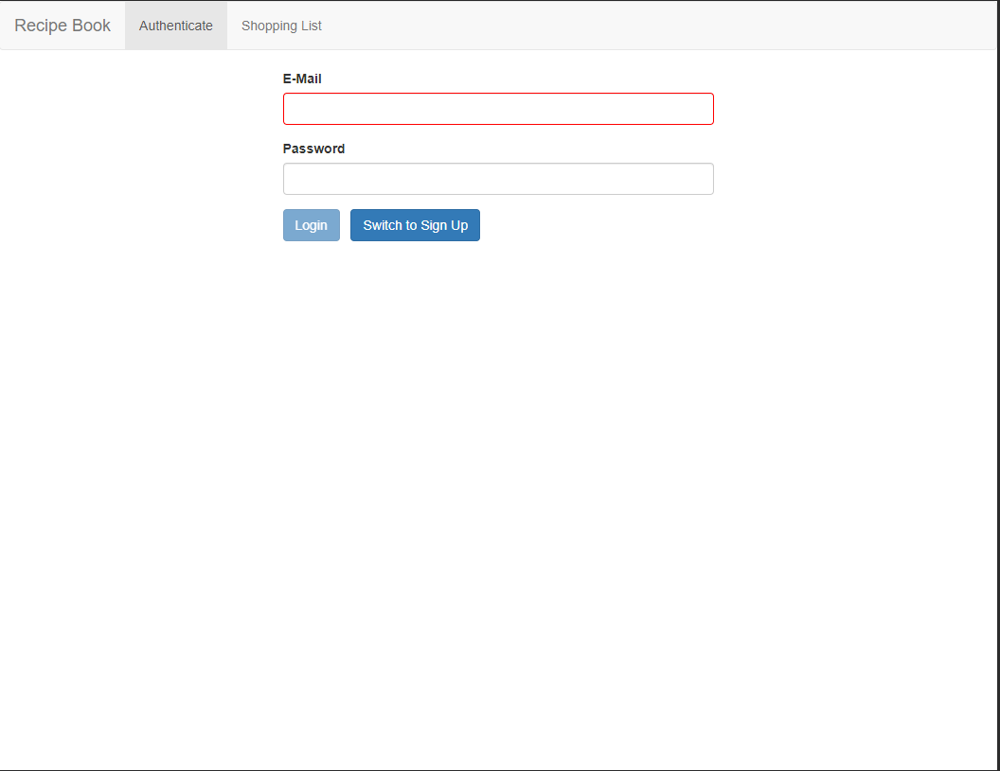
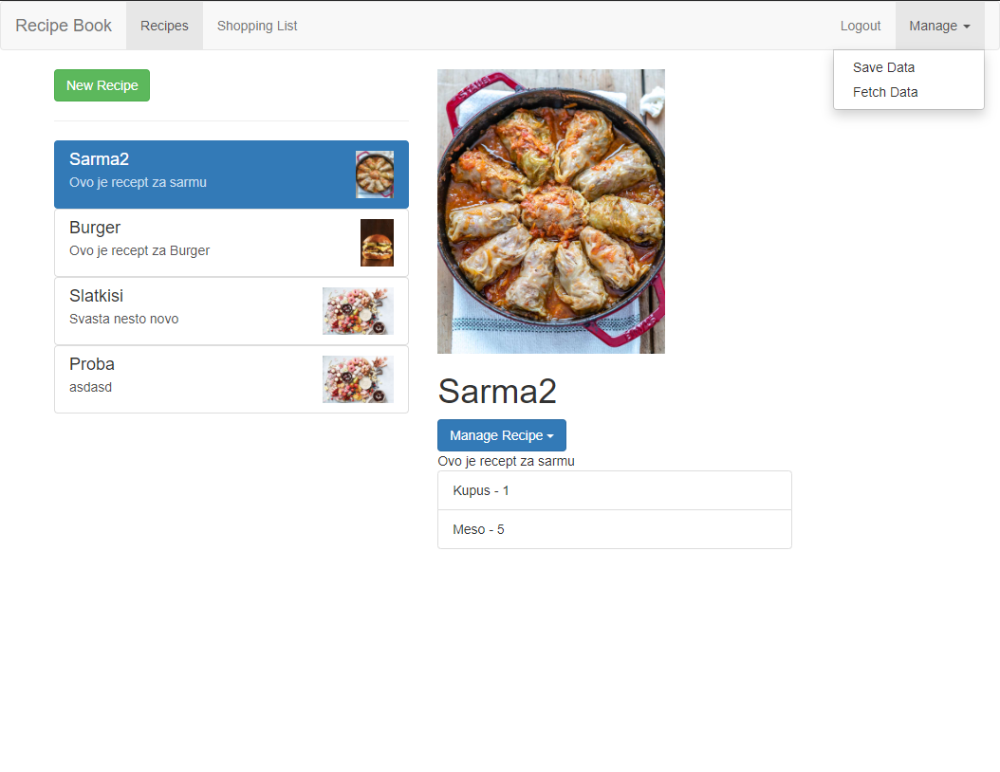
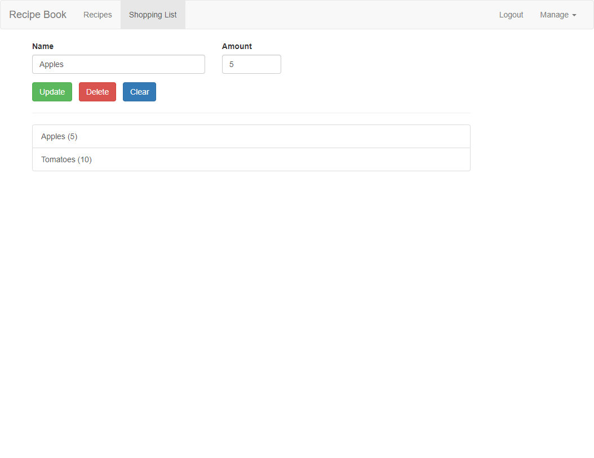

# RecipesApp

[Application on firebase](https://angularcourseprojectrecipes.web.app/auth)

Following [Angular - The Complete Guide](https://www.udemy.com/course/the-complete-guide-to-angular-2/) 

Table of contents:
 - Which architecture Angular uses
 - How to use TypeScript to write Angular applications
 - All about directives and components, including the creation of custom directives/ components
 - How databinding works
 - All about routing and handling navigation
 - What Pipes are and how to use them
 - How to access the Web (e.g. RESTful servers)
 - What dependency injection is and how to use it
 - How to use Modules in Angular
 - How to optimize your (bigger) Angular Application
 - An introduction to NgRx and complex state management
 - We will build a major project in this course so that you can practice all concepts

## Screenshots

